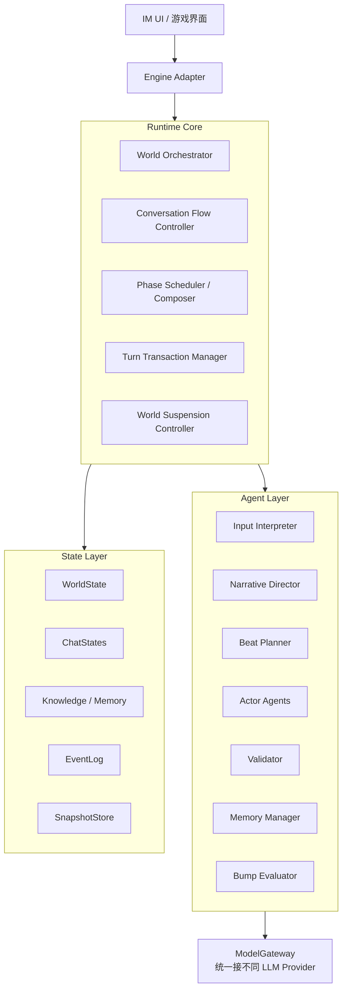

# 01. 框架总纲与边界

## 1. 框架目标

Chat Drama 的目标是提供一个**内容无关、引擎无关、模型无关**的 AI 叙事运行时。

它服务于这种游戏形态：

```text
一台模拟手机
  多个 IM 聊天
    单聊 / 群聊
      多个 NPC 角色
        角色有记忆、状态、知识、关系
      用户自由输入文本
      剧情按 Phase 编排推进
```

框架本身不绑定具体世界观、剧本、模型厂商、UI 引擎。

---

## 2. 设计哲学

### 2.1 LLM 不是世界真相

LLM 负责：

- 理解用户输入
- 提议剧情走向
- 生成角色发言
- 总结记忆
- 辅助校验

但 LLM 不直接拥有最终权力。

最终权力在：

- 结构化世界状态
- Storylet / Arc / Route
- Evidence Gate
- StateManager
- Validator

### 2.2 角色不是全知脚本生成器

每个 Actor 只能看到自己的：

- 人设
- 状态
- 局部知识
- 记忆
- 误解
- 当前任务

Actor 不看全局真相，不看未来反转。

### 2.3 单聊和群聊统一

单聊和群聊不是两套系统。它们都是：

```text
ChatSession
```

区别仅在：

- participants 数量
- speaker 编排复杂度
- phase 内 beat 数量

### 2.4 前台会话驱动剧情

一个存档等于一台手机。手机里可以有很多聊天，但只有一个前台会话。

只有前台会话：

- 用户可打断
- 用户回应窗 timer 运行
- 用户输入直接进入该会话

后台会话：

- 可以显示通知
- 可以完成当前一期显现
- 结束后挂起
- timer 不运行
- 不自动无限推进

---

## 3. 明确不做

当前框架不设计以下内容：

| 项目 | 说明 |
|---|---|
| 多真人 | 只有一个真人主控/主角，不支持多真人 |
| 多消息类型 | 暂只做纯文本消息类型 |
| 消息撤回 | 玩家和角色消息都不可撤回 |
| 多个前台对话 | 同一时间只有一个 foreground chat |
| 角色离线系统 | 暂定全员随时可响应 |
| 真实时间推进剧情 | 剧情由事件离散推进 |
| 戏内回溯 | 严重偏差时死档，用户需自行读档 |

---

## 4. 框架分层



---

## 5. 最小闭环

最小闭环如下：

```text
用户进入聊天
  ↓
该聊天成为前台
  ↓
用户回应 / 超时
  ↓
系统生成下一 PhaseBrief
  ↓
机制编排 Beat
  ↓
Actor 生成气泡
  ↓
Validator 校验
  ↓
Phase staged
  ↓
开始显现
  ↓
用户可打断：回到 PhaseBrief 与机制编排 Beat
  ↓
显现完成
  ↓
打开 ResponseWindow
  ↓
等待用户输入
  ↓
提交状态，检查后台 bump
```

