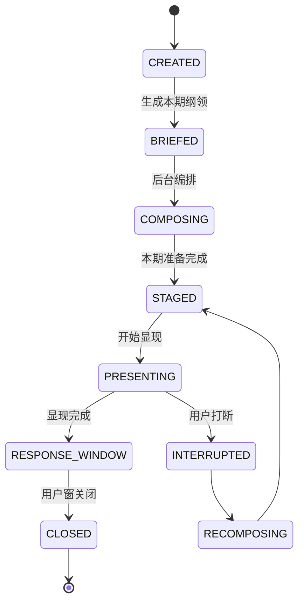
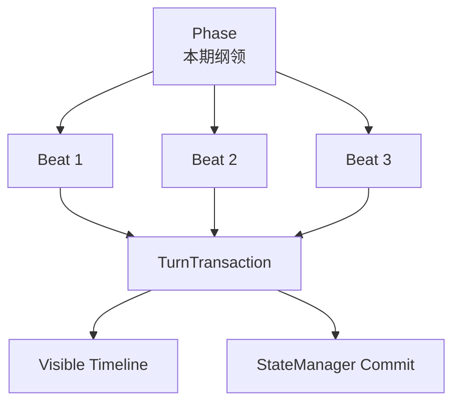

# 03. Phase / Beat / Transaction

## 1. 三者边界

```text
Phase = 叙事编排单位
Beat = Phase 内部拍点
Transaction = 显现和状态提交单位
```

### Phase

决定这一期要完成什么。

### Beat

决定这一步谁说、说什么方向。

### Transaction

决定哪些东西最终算数。

---

## 2. Phase 状态机



---

## 3. Phase 编写流程

用户不在 Phase 编写过程中打断。  
用户只能在 `PRESENTING` 或 `RESPONSE_WINDOW` 阶段介入。

```kotlin
fun composePhase(brief: PhaseBrief): StagedPhase {
    val phase = Phase(brief)

    while (!phase.isComplete()) {
        val beatPlan = mechanism.decideNextBeat(
            brief = phase.brief,
            beatsSoFar = phase.beats,
            visiblePrefix = phase.visiblePrefix,
            cancelledDrafts = phase.cancelledDrafts
        )

        val actorInput = perspectiveFilter.buildActorInput(
            speaker = beatPlan.speaker,
            beatPlan = beatPlan,
            phase = phase
        )

        val actorOutput = actorAgent.generate(actorInput)

        val review = beatReviewer.review(
            beatPlan = beatPlan,
            actorOutput = actorOutput,
            phase = phase
        )

        if (review.accepted) phase.addBeat(review.beat) else phase.applyRepair(review.repairInstruction)
    }

    return phase.toStagedPhase()
}
```

---

## 4. Beat 数据结构

```kotlin
data class BeatPlan(
    val speaker: CharacterId,
    val task: String,
    val mustMention: List<FactId>,
    val mustAvoid: List<FactId>,
    val expectedBubbleCount: IntRange,
    val emotionalDirection: String?,
    val completionHint: String?
)

data class Beat(
    val id: BeatId,
    val speaker: CharacterId,
    val task: String,
    val bubbles: List<PlannedBubble>,
    val visibleGatedPatches: List<VisibleGatedPatch>,
    val notes: String
)
```

一个 Beat 可以生成多个气泡，但必须服务于同一个小目标。

---

## 5. Transaction 数据结构

```kotlin
data class TurnTransaction(
    val id: TransactionId,
    val phaseId: PhaseId,
    val visibleMessages: MutableList<MessageId>,
    val cancelledBubbles: MutableList<PlannedBubble>,
    val visibleGatedPatches: MutableList<VisibleGatedPatch>,
    val phaseClosePatches: MutableList<StatePatch>,
    val status: TransactionStatus
)
```

Transaction 不负责写台词，它负责记账：

- 哪些气泡已经显现
- 哪些气泡被取消
- 哪些状态应在消息 visible 后提交
- 哪些状态应在 Phase 结束后提交

---

## 6. Phase 与 Transaction 的关系



---

## 7. Phase 完成条件

Phase Completion 不能完全交给 LLM 感觉。

建议至少有以下字段：

```kotlin
data class PhaseCompletionSpec(
    val requiredBeatTags: Set<String>,
    val requiredReveals: Set<FactId>,
    val emotionalArc: String?,
    val maxBeats: Int,
    val allowDirectorSatisfied: Boolean
)
```

规则：

1. `directorSatisfied` 不能单独作为唯一完成条件。
2. 超过 `maxBeats` 必须收束。
3. 若 required reveal 未完成，Phase 不应自然结束。
4. 若 Phase 被用户打断，则进入 recomposing，而不是直接失败。

---

## 8. 一期示例

```json
{
  "goal": "让艾琳承认去过旧车站", // `但不能透露伯爵` 既然不透露，所以届时不应写在JSON中
  "participants": ["AILIN"],
  "allowedReveals": ["AILIN_WENT_TO_OLD_STATION"],
  "forbiddenReveals": ["COUNT_IS_KILLER"],
  "completion": {
    "requiredReveals": ["AILIN_WENT_TO_OLD_STATION"],
    "maxBeats": 3
  },
  "ResponsePhase": {
    "durationSeconds": 60,
    "allowMultipleBubbles": true
  }
}
```
