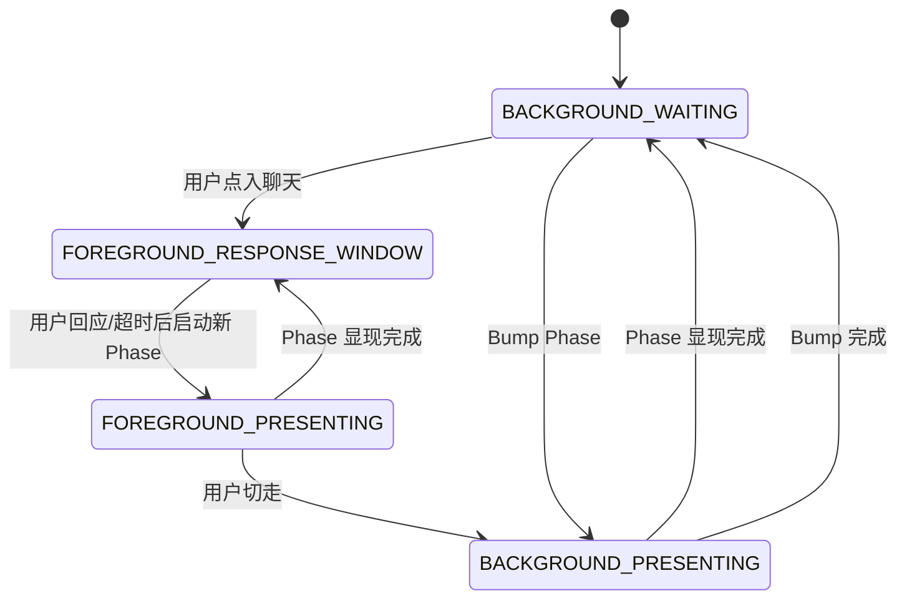

# 04. 多聊天与前后台会话

## 1. 基本原则

一个存档是一台手机，一台手机里有多个聊天。

但同一时间只有一个：

```text
foregroundChat
```

框架暂不支持多个会话同时作为主会话运行。

---

## 2. 前台会话

前台会话是用户当前打开的聊天。

前台会话拥有：

- 用户输入权
- 打断权
- ResponseWindow timer
- Phase 主推进权

只有前台会话中，用户在 `PRESENTING` 阶段发送消息才算打断。

---

## 3. 后台会话

后台会话不是死的，但不是主会话。

后台会话可以：

- 继续显现已开始的一期
- 通过通知展示新消息
- 完成当前 Phase 后挂起
- 等用户点进来再启动回应窗 timer

后台会话不可以：

- 被用户打断
- 自动无限进入下一期
- 运行回应窗 timer
- 抢占前台主推进权

---

## 4. 用户切走时的规则

如果用户切走某聊天时，该聊天正在 `PRESENTING`：

```text
该 Phase 继续显现
未读数增加
可弹通知
用户不能打断
Phase 显现完后进入 BACKGROUND_WAITING
ResponseWindow timer 不走
```

---

## 5. 用户切入后台聊天

用户点进后台聊天后：

```text
chat -> foregroundChat
若存在等待中的 ResponseWindow:
  timer 不立即启动
  等用户点击输入框后
  按完整 window 时长重新开始
```

---

## 6. Bump Phase

前台会话的状态变化可能导致后台聊天必须有反应。

例如：

```text
艾琳在私聊中承认去过旧车站
  ↓
群聊需要出现一拨新反应
```

这叫 Bump Phase。

Bump 规则：

1. Bump 只生成一期。
2. Bump 可以在后台显现。
3. Bump 完成后挂起。
4. 不连续自动起新期。
5. 多个相同原因的 bump 用 mergeKey 合并。

---

## 7. Chat 状态机



---

## 8. 时间语义

剧情时间是离散推进的。

真实物理时间不会自动推动剧情。

只有前台 `ResponseWindow` 的 timer 会运行。

后台 timer 一律暂停。

