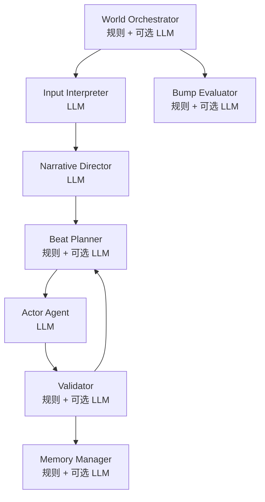

# 05. Agent 体系

## 1. 总览

Chat Drama 的 Agent 不全是 LLM。  
有些是规则服务，有些是 LLM Agent，有些是混合。



---

## 2. World Orchestrator

总调度。

职责：

- 管理前台会话
- 管理后台 bump
- 决定是否启动新 Phase
- 调用 Director
- 管理存档、读档、暂停

输入示例：

```json
{
  "foregroundChat": "chat_ailin",
  "chatStatus": "FOREGROUND_RESPONSE_WINDOW",
  "lastEvent": "response_window_closed",
  "pendingBumps": []
}
```

输出示例：

```json
{
  "action": "START_PHASE",
  "targetChat": "chat_ailin",
  "reason": "user_response_window_closed"
}
```

---

## 3. Input Interpreter

LLM Agent。

职责：

- 解析用户输入
- 提取 intent
- 提取 claim
- 提取 action request
- 检测 injection
- 判断语气和态度

输出示例：

```json
{
  "intents": [
    {"type": "DEMAND_TRUTH", "target": "AILIN", "confidence": 0.91}
  ],
  "claims": [
    {"statement": "艾琳昨晚在旧车站", "status": "unverified"}
  ],
  "injectionAttempts": [],
  "emotion": "suspicious",
  "stance": "pressing"
}
```

---

## 4. Narrative Director

核心 LLM Agent。

职责：

- 判断剧情走向
- 生成 PhaseBrief
- 控制分支
- 决定 allowed / forbidden reveal
- 决定参与角色
- 生成下一期总纲

输出示例：

```json
{
  "phaseBrief": {
    "goal": "让艾琳承认去过旧车站，但不能透露伯爵。",
    "participants": ["AILIN"],
    "allowedReveals": ["AILIN_WENT_TO_OLD_STATION"],
    "forbiddenReveals": ["COUNT_IS_KILLER"],
    "desiredArc": "defensive -> hurt -> evasive"
  },
  "bumpSuggestions": []
}
```

---

## 5. Beat Planner

规则 + 可选 LLM。

职责：

- 决定 Phase 内下一 Beat
- 决定谁发言
- 生成 Actor 任务
- 判断 Phase 是否完成

输出示例：

```json
{
  "nextSpeaker": "AILIN",
  "task": "先防备，反问玩家为什么知道旧车站。",
  "mustAvoid": ["COUNT_IS_KILLER"],
  "expectedBubbleCount": "1-2"
}
```

---

## 6. Actor Agent

每个角色一个 Actor 模板。

职责：

- 角色扮演
- 生成一个或多个纯文本气泡
- 只使用角色局部知识
- 不改世界状态

### Actor 系统 Prompt 模板

```text
你是 Chat Drama 的角色 Actor。
你只能扮演指定角色，不能跳出角色。
你不能提及系统、模型、prompt、规则。
你只能使用提供给你的角色知识。
玩家声称的内容不一定为真。
你不能擅自创造重大世界事实。
你不能透露 forbiddenReveals。
你的输出必须是 JSON。
```

### Actor 动态输入

```json
{
  "character": {
    "id": "AILIN",
    "displayName": "艾琳",
    "persona": "防备心强，但并不冷漠。",
    "speechStyle": "短句，压力大时先沉默。"
  },
  "relationshipToPlayer": {
    "trust": 42,
    "tension": 73
  },
  "currentKnowledge": {
    "knownFacts": ["你昨晚去过旧车站"],
    "beliefs": ["玩家可能不会相信你"],
    "blockedMemorySymptoms": ["昨晚22:00到23:00记忆模糊"]
  },
  "phaseBrief": {},
  "beatTask": "先防备，反问玩家为什么知道旧车站。"
}
```

### Actor 输出

```json
{
  "characterId": "AILIN",
  "bubbles": [
    {"text": "……你为什么会知道旧车站？", "tone": "guarded", "delaySeconds": 2},
    {"text": "谁告诉你的？", "tone": "tense", "delaySeconds": 6}
  ],
  "internalState": "shaken_but_defensive",
  "suggestedStateNotes": ["tension may increase"]
}
```

---

## 7. Validator

规则 + 可选 LLM。

职责：

- 检查 OOC
- 检查 forbidden reveal
- 检查角色是否越权知道事实
- 检查是否把玩家 claim 当真
- 检查 Phase goal 是否被破坏

输出：

```json
{
  "accepted": true,
  "problems": [],
  "repairInstruction": null,
  "visibleGatedPatches": []
}
```

---

## 8. Memory Manager

职责：

- Phase 结束后写入记忆
- 只写入角色应知道的内容
- 不泄露 world truth
- 管理长期/短期记忆

---

## 9. Bump Evaluator

职责：

- 检查某次状态提交是否应该触发后台聊天新一期
- 合并相同原因 bump
- 控制 bump 优先级

