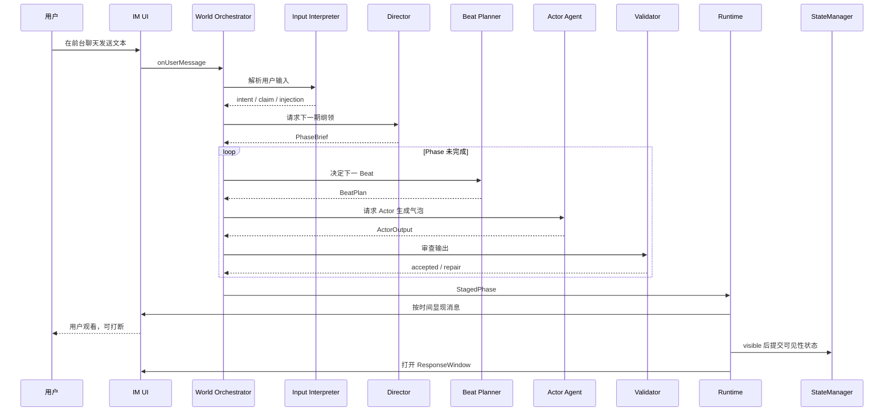
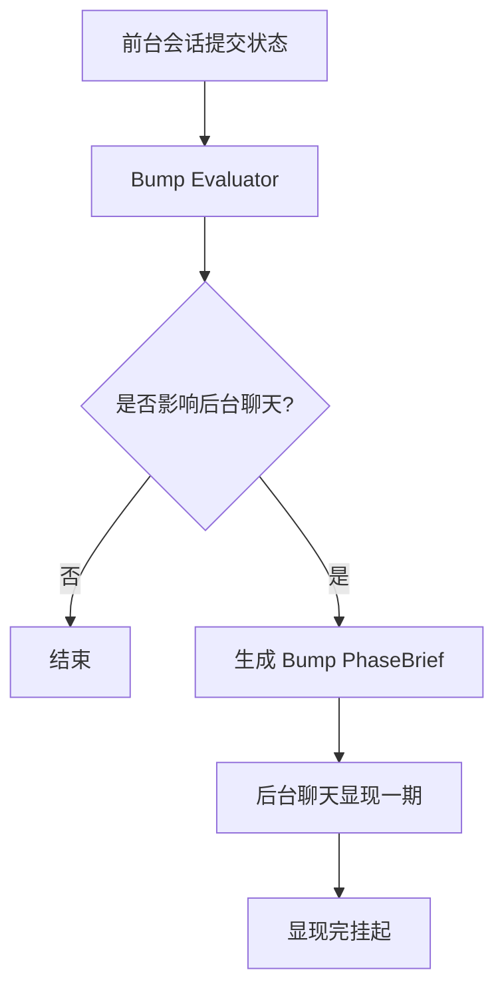

# 06. 运行时流程

## 1. 总流程



---

## 2. 用户回应窗关闭

回应窗关闭原因：

- 用户发送并提交
- 用户多条气泡满足关闭条件
- 前台 timer 超时

关闭后进入：

```text
InputInterpreter -> Director -> Phase composing
```

---

## 3. Phase 编排阶段

Phase 编排发生在后台。

用户此时看不到本期内容，因此不能打断。

编排完成后得到：

```text
StagedPhase
  beats[]
  plannedBubbles[]
  visibleGatedPatches[]
  phaseClosePatches[]
```

---

## 4. Phase 显现阶段

显现阶段是用户看到 NPC 消息逐条上屏的阶段。

此时：

- 前台用户可打断
- 后台用户不可打断
- 已显现消息不可撤回
- 未显现消息可取消

---

## 5. 打断后重编排

```text
用户打断
  ↓
保留已显现消息
  ↓
取消未显现 bubbles
  ↓
记录 cancelledDrafts
  ↓
把 visiblePrefix + 用户新消息 + cancelledDrafts 给机制
  ↓
重新进入本期 RECOMPOSING
```

---

## 6. Bump 流程



---

## 7. 运行时模块

```text
WorldOrchestrator
  管理全局流程

ConversationFlowController
  管理前台/后台、输入、打断、超时

PhaseComposer
  编排 Phase 和 Beat

TurnTransactionManager
  管理可见性提交与取消

WorldSuspensionController
  管理调试暂停、存档、读档
```

---

## 8. 伪代码

```kotlin
suspend fun runForegroundResponse(chatId: ChatId, userMessages: List<String>) {
    val interpreted = inputInterpreter.interpret(chatId, userMessages)
    val phaseBrief = director.planNextPhase(chatId, interpreted, worldState)
    val stagedPhase = phaseComposer.compose(phaseBrief)
    presentation.present(chatId, stagedPhase)
    openResponseWindow(chatId, phaseBrief.responseWindow)
}
```

```kotlin
suspend fun present(chatId: ChatId, phase: StagedPhase) {
    for (bubble in phase.plannedBubbles) {
        if (flowController.hasForegroundInterruption(chatId)) {
            transaction.cancelRemaining(phase)
            recomposePhaseFromInterruption(chatId, phase)
            return
        }

        showTyping(bubble)
        showBubble(bubble)
        transaction.commitVisibleGatedPatches(bubble)
    }

    transaction.commitPhaseClosePatches(phase)
}
```

