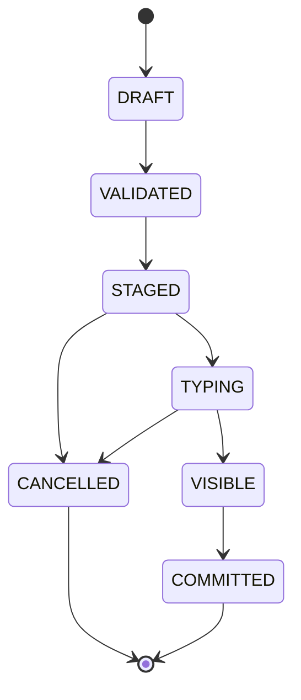

# 08. 打断、超时、显现、提交

## 1. 消息生命周期



---

## 2. 可取消边界

```text
VISIBLE 前：可以取消
VISIBLE 后：不可撤回
```

不做消息撤回。

---

## 3. 打断规则

打断发生时：

1. 用户消息立即进入 visible timeline。
2. 已显现 NPC 消息保留。
3. 未显现 NPC bubbles 取消。
4. cancelledDrafts 作为“角色本来想说的话”交给机制。
5. 当前 Phase 进入 RECOMPOSING。

---

## 4. 打断输入

```json
{
  "phaseGoal": "让艾琳承认去过旧车站，但不能透露伯爵",
  "visiblePrefix": [
    "艾琳：……你连这个也知道了？",
    "玩家：等等，‘连这个也知道了’是什么意思？"
  ],
  "cancelledDrafts": [
    "艾琳：我确实去过旧车站。",
    "艾琳：但我不是去放火的。"
  ],
  "instruction": "已显现内容不可撤回。未显现内容只作为参考。重新编排后续。"
}
```

---

## 5. 超时规则

超时表示：

> 角色不再继续等待用户。

超时不禁用用户输入。

前台回复窗口期超时后：

```text
ResponsePhase timeout
  ↓
机制生成下一 Phase
  ↓
NPC 开始显现
  ↓
用户仍可输入
  ↓
若输入，触发打断
```

后台回应窗 timer 不运行，因此不会后台超时。

---

## 6. 状态提交规则

### 6.1 消息没显现，不提交 reveal

如果某条消息未 visible，则与它绑定的状态变化不提交。

### 6.2 visible 后提交 message-gated patch

```json
{
  "whenVisible": "我确实去过旧车站。",
  "patch": {
    "factVisibility": {
      "AILIN_WENT_TO_OLD_STATION": "player_visible"
    }
  }
}
```

### 6.3 Phase 结束后提交关系变化

关系、好感、紧张度等通常在 Phase close 时统一结算。

### 6.4 玩家消息发送即 visible

玩家消息没有后台草稿阶段。  
点击发送后即进入 visible timeline，不可撤回。

---

## 7. State Patch 白名单

### Actor 可建议

- emotion
- tone
- minor relationship delta
- memory note

### Director 可建议

- phase brief
- allowed / forbidden reveal
- storylet trigger
- branch tag

### StateManager 才能提交

- fact visibility
- quest stage
- route lock
- ending flag
- major relationship change
- clue acquired

---

## 8. Transaction 责任

Transaction 负责追踪：

- visible messages
- cancelled bubbles
- visible gated patches
- phase close patches
- commit status

所有状态变化必须通过 Transaction 进入 StateManager。

